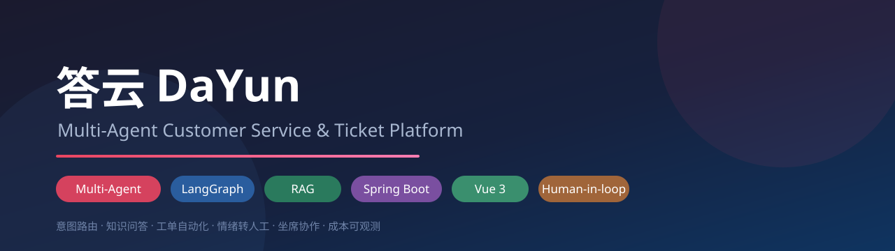
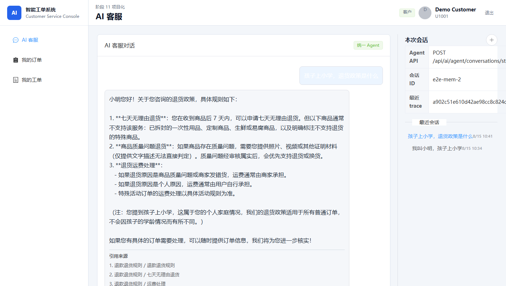
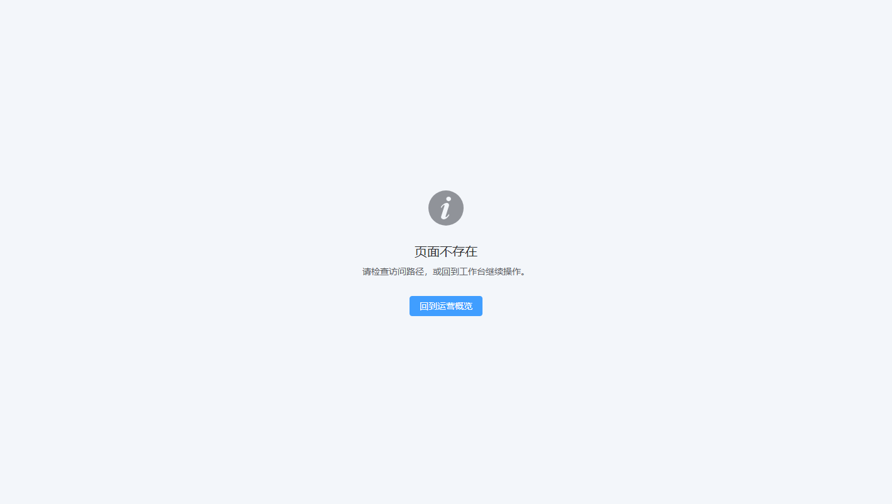
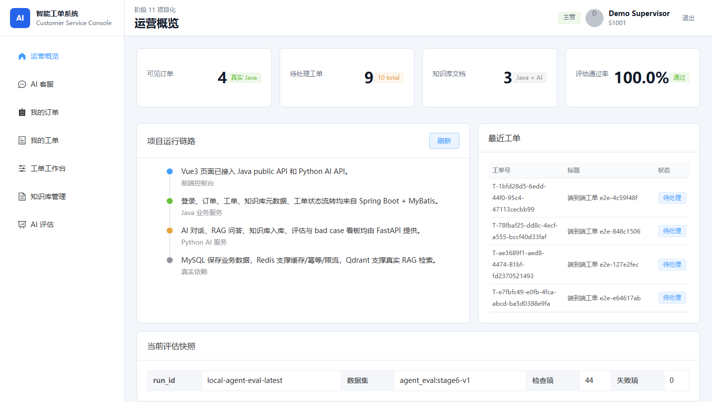
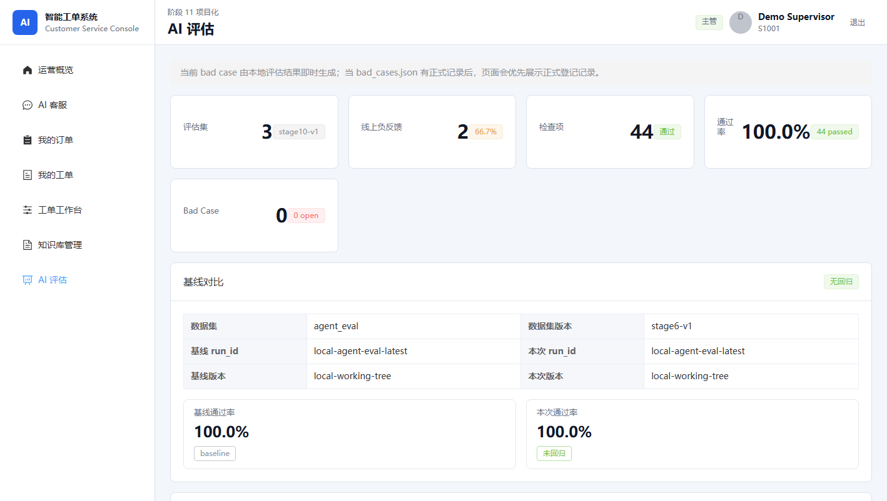
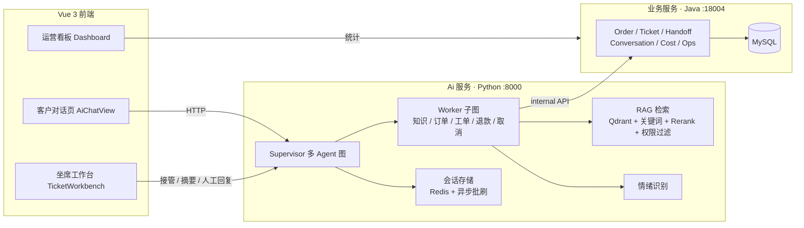

# 答云 DaYun —— 智能客服与工单协作平台

> Smart Customer Service & Ticket Collaboration Platform



[](LICENSE)
[](projects/ai-service)
[](projects/java-business-service)
[](projects/customer-service-console)
[](#测试)
[](#测试)

一个**全栈多 Agent 智能客服系统**的完整实现：既能像普通客服一样回答产品/物流/售后问题，也能自动完成查订单、提交工单、申请退款/取消等真实业务动作，遇到情绪激动的用户会自动转接人工坐席。

- **AI 服务**（Python / FastAPI / LangGraph）：多 Agent 意图路由、RAG 知识问答、工具调用、情绪识别、自动化评测
- **业务服务**（Java / Spring Boot）：订单、工单、用户、知识库元数据、转人工队列、会话持久化、成本统计
- **前端**（Vue 3 / Element Plus）：客户对话页 + 坐席工作台（工单/转人工/接管/成本与运营看板）

<details>
<summary>📑 目录</summary>

- [功能亮点](#-功能亮点)
- [快速开始](#-快速开始)
- [配置](#配置)
- [架构](#架构)
- [设计取舍](#设计取舍)
- [测试](#测试)
- [API 概览](#主要-api-概览)
- [FAQ](#faq)
- [致谢](#致谢)

</details>

## ✨ 功能亮点

| 模块 | 能力 | 亮点 |
| --- | --- | --- |
| 🤖 **多 Agent 对话** | Supervisor 分派 + Worker 子图（知识/订单/工单/退款/取消） | LLM 路由失败自动降级规则，意图/字段双路径（规则 ⇄ LLM ⇄ fake） |
| 🧠 **跨会话记忆** | 从对话提取用户事实（称呼/地址/家庭/联系方式）→ Redis 存储 → 下次提问自动注入上下文 | 规则 ⇄ LLM 双路径提取、按类别去重、`GET/DELETE /api/ai/agent/memory` 可查可清 |
| 🔍 **思考透明化** | SSE 流实时展示 Agent 过程：检索命中哪个知识库、调用哪个工具、用了哪个模型 | 前端可折叠"思考过程"时间线；`detail` 事件向后兼容，关闭开关可退回纯阶段展示 |
| 📚 **RAG 知识问答** | 混合检索（关键词+向量）+ Rerank + 引用溯源 | 权限过滤、上下文压缩、查询改写、多路查询，PDF/Markdown/txt 入库 |
| 🎫 **工单自动化** | 意图分类 → 字段提取 → 用户确认 → 创建/退款/取消执行 | 全流程幂等（MySQL 唯一索引 + 请求指纹），确认后才落库 |
| 😤 **情绪识别与转人工** | 愤怒/焦虑/急切 → 自动转人工（多 Agent 与单 Agent 双路径） | 情绪字段注入对话链路，转人工队列自动生成 |
| 🧑‍💼 **坐席协作** | 转人工队列、接管会话、坐席转移、LLM 会话摘要、人工回复回写 | 接管期间 AI 自动让位；转移/关闭全审计（note + resolved_at） |
| 📊 **运营分析** | 满意度、转人工量、情绪分布、每日对话量、LLM 成本、评估快照 | 多模型成本按意图聚合；RAG 检索质量（Hit@K/MRR）落库可视化 |
| 🔧 **工程化** | 1900+ 测试（TDD）、自建 pytest e2e 框架、可观测性 | OTel 链路追踪、限流/幂等/安全边界、Prompt 注入防护、`/health/dependencies` 依赖体检 |

## 🖥️ 演示效果

**客户对话页**：多 Agent 流式回复、跨会话记忆注入（上次会话说"孩子上小学"，本次回答自动带上称呼与背景）、思考过程时间线、工单确认单。



**坐席工作台**：工单队列 + 转人工队列（接管/转移/关闭/人工回复）。



**运营看板**：满意度、转人工量、情绪分布、每日对话量、LLM 成本（按模型/意图聚合）、依赖健康检查。



**AI 评测页**：评测趋势、RAG 检索质量（Hit@K / Recall@K / MRR）、Bad Case 登记与回归。



**快速体验**：启动后打开 `http://localhost:5173`，用客户账号 `U1001` 提问，按下方「演示流程」四条路径走一遍即可看到完整闭环。

## 架构



**数据流**：客户消息 → Supervisor 意图路由 → Worker 执行（查订单 / RAG 问答 / 建工单前先要用户确认）→ 情绪识别（愤怒/急切 → 自动转人工）→ 会话异步落库 MySQL；坐席在工作台认领转人工会话 → AI 停止应答 → 坐席回复直接回写客户会话 → 关闭后恢复 AI。

## 设计取舍

### 为什么用多 Agent 分工，而不是单一大模型一把梭？

| 关注点 | 单 Agent（一次大模型调用） | 本项目多 Agent 分工 |
| --- | --- | --- |
| 意图识别 | 依赖模型自由发挥，不可控 | 专用意图分类节点 + 规则 ⇄ LLM 双路径，路由失败自动降级 |
| 业务动作 | 模型直接编工具调用 | 先分派（查订单/建工单/退款/取消）再执行，**写操作必须用户确认** |
| 知识问答 | 全量上下文塞给模型 | 按知识库路由（政策/物流/账户）+ 权限过滤后再检索 |
| 成本 | 每轮全量消耗 | 按意图只调必要 Worker，成本按模型/意图聚合可观测 |
| 可靠性 | 单点失败即崩 | Worker 子图隔离 + 情绪转人工兜底，人工可随时接管 |

**关键取舍**：

- **写操作先确认后执行**：工单/退款/取消的字段由 LLM 提取后**回显确认单**，用户批准才幂等落库——防止模型幻觉直接产生业务副作用。
- **规则 ⇄ LLM ⇄ fake 三路径**：未配置 API Key 时全链路可用（规则分类 + fake embedding），CI 与演示零外部依赖。
- **情绪识别独立成节点**：愤怒/急切/焦虑在对话链路中被显式识别并触发转人工，而不是让模型"顺便"判断。
- **会话双写**：Redis（实时，TTL 30 天）+ 异步批刷 MySQL（持久），Redis 丢失可从 MySQL 回源重建。

## 快速开始

### 前置环境

| 依赖 | 版本 | 说明 |
| --- | --- | --- |
| Python | 3.12 | 需 [`uv`](https://docs.astral.sh/uv/) |
| Java | 21 + Maven | 业务服务 |
| Node.js | 18+ | 前端 |
| MySQL | 8.x | 业务数据（Java 自动建表） |
| Redis | 7.x | 缓存 / 限流 / 会话 / 幂等 |
| Qdrant | 最新 | 向量检索（可选，缺省时 RAG 走降级） |

没有 MySQL/Redis/Qdrant 时，可用 `docker compose up -d` 启动基础设施（qdrant + milvus），或参考 [`docs/local-run-and-demo.md`](docs/local-run-and-demo.md) 的远程基础设施方案。

### 1. AI 服务

```bash
cd projects/ai-service
uv sync
cp .env.example .env        # 填 LLM_API_KEY 与基础设施地址
uv run uvicorn app.main:app --host 127.0.0.1 --port 8000
```

### 2. 业务服务

```bash
cd projects/java-business-service
mvn spring-boot:run         # :18004，启动时自动建表（schema.sql）
```

### 3. 前端

```bash
cd projects/customer-service-console
npm install
npm run dev                 # http://localhost:5173
```

### 4. 验证

```bash
# 一键回归（Python + Java 全量）
python scripts/run_regression.py

# AI 服务单测
cd projects/ai-service && uv run pytest -q

# 端到端（需要三个服务 + 基础设施在跑；自动起停三服务）
cd projects/ai-service && uv run pytest tests/e2e -m e2e --run-e2e
```

**开发默认账号**：客户 `U1001` / 坐席 `A1001` / 主管 `S1001`（见 `application.yml` 与前端登录页，开发环境专用）。

## 配置

**AI 服务**（`projects/ai-service/.env`，模板见 `.env.example`）：

| 变量 | 必填 | 说明 | 默认/示例 |
| --- | --- | --- | --- |
| `LLM_API_KEY` | 否* | 模型 Key；留空自动走 rule_based/fake 模式 | 空 |
| `LLM_PROVIDER` / `LLM_MODEL` | 否* | 兼容 OpenAI 协议的供应商与模型 | `aliyun-compatible` / `qwen3.7-plus` |
| `LLM_BASE_URL` | 否* | 模型端点 | 阿里云 MaaS 兼容端点 |
| `AGENT_REDIS_URL` | 是 | 会话/缓存/限流/幂等 Redis | `redis://127.0.0.1:6379/0` |
| `QDRANT_BASE_URL` | 是 | 向量检索服务 | `http://127.0.0.1:6333` |
| `JAVA_BUSINESS_SERVICE_BASE_URL` | 是 | Java 业务服务地址 | `http://127.0.0.1:18004` |
| `JAVA_BUSINESS_INTERNAL_TOKEN` | 是 | internal 接口令牌（开发默认值） | `local-dev-internal-token` |

\* 演示默认允许留空；**生产必须配置真实模型与密钥**。

**业务服务**（环境变量，见 `application.yml`）：`JAVA_BUSINESS_DB_URL` / `JAVA_BUSINESS_DB_USERNAME` / `JAVA_BUSINESS_DB_PASSWORD`、`JAVA_BUSINESS_REDIS_HOST` / `JAVA_BUSINESS_REDIS_PORT`、`JAVA_BUSINESS_INTERNAL_TOKEN`。

**前端**（`projects/customer-service-console/.env`）：`VITE_AI_API_BASE_URL`（默认 `http://127.0.0.1:8000`）、`VITE_JAVA_API_BASE_URL`（默认 `http://127.0.0.1:18004`）。

## 主要 API 概览

**AI 服务**（`:8000`，鉴权 `Authorization: Bearer local-dev-token:default:{user_id}`）

| 端点 | 说明 |
| --- | --- |
| `POST /api/ai/agent/conversations` | 客户对话（多 Agent 图，含确认/转人工/情绪） |
| `GET /api/ai/agent/conversations/{id}/history` | 会话历史（Redis → MySQL 回源） |
| `POST /api/ai/agent/conversations/{id}/human-reply` | 坐席人工回复（接管期间） |
| `GET /api/ai/agent/conversations/{id}/summary` | LLM 会话摘要（失败降级规则摘要） |
| `POST /api/ai/agent/conversations/{id}/human-handoff` | 坐席主动转人工 |
| `POST /api/ai/rag/ask` | RAG 问答（权限过滤 + 引用） |
| `POST /api/knowledge-base/documents` | 知识库文档入库（PDF/MD/txt，也支持 `/documents/upload`） |
| `GET /api/ai/evaluation/...` | 评测快照 / RAG 检索质量 |
| `GET /api/ai/ops-stats/summary` | 运营看板聚合 |
| `GET /api/ai/cost/overview` | LLM 成本（按模型 / 意图） |
| `GET /health/dependencies` | 依赖体检（Java/MCP/Redis/Qdrant） |

**业务服务**（`:18004`）：`/internal/orders`、`/internal/tickets`（AI 内部调用）、`/api/orders`、`/api/tickets`（客户/坐席）、`/api/human-handoffs`（转人工队列：列表/认领/关闭/转移）——完整契约见 [`docs/java-ai-api-contract.md`](docs/java-ai-api-contract.md)。

## 演示流程

> 启动三服务后，用客户账号在对话页体验：

**① 查物流**：`我的订单 202501010001 到哪了` → 多 Agent 路由到订单 Worker → 调用 Java 订单接口返回实时物流。

**② 工单自动化**：`我要申请退货，订单 202501010001` → AI 提取字段 → **回显确认单** → 你点"确认" → 幂等创建工单。

**③ 情绪转人工**：`气死了！三天了还不发货！` → 情绪识别 ANGRY → 自动生成转人工工单 → 用坐席账号在**工作台「转人工」页**认领 → 接管后客户再发消息由你人工回复 → 处理完关闭，客户会话恢复正常 AI 应答。

**④ RAG 问答**：`退款政策是什么` → 关键词+向量混合检索 → 引用来源给出回答；提问命中无权限知识库时返回"无权访问"。

## 测试

| 层 | 数量 | 覆盖 |
| --- | --- | --- |
| AI 服务单测 | 1700+ | agent 节点/工具/接口/评测/成本/安全边界/权限过滤 |
| Java 单测 | 120+ | Mapper（H2）/Controller/鉴权/幂等/限流/契约 |
| e2e 真实链路 | 7 | 自动起停 Java/Python/MCP 三服务：冒烟、工单创建、转人工全流程、RAG 问答、会话持久化回源、运营聚合 |
| 前端 | `npm run build` | vue-tsc 类型检查 + Vite 构建 |

e2e 套件曾捕获真实生产 bug（Java 侧 `senderType` 校验缺 `human_agent`，导致人工回复批刷一直 422 重试）。

## 项目结构

```
projects/
  ai-service/                  # AI 服务（FastAPI + LangGraph）
    app/agents/                # 多 Agent 图、Supervisor、worker 子图、意图/情绪/评测
    app/rag/                   # RAG：检索/rerank/权限/知识库/评测/混合检索
    app/services/              # LLM、工具调用、会话存储、Java 客户端、成本/同步
    app/routers/               # HTTP 接口（chat/rag/eval/ops-stats/cost/health）
    tests/                     # 1700+ 单测 + tests/e2e 真实链路
  java-business-service/       # 业务服务（Spring Boot + MyBatis + MySQL）
  customer-service-console/    # 前端（Vue 3 + Element Plus）
scripts/run_regression.py      # 一键回归（Python + Java 全量测试）
docs/                          # 接口契约、数据库设计、本地运行指南
```

## FAQ

**Q：不配置 LLM_API_KEY 能跑吗？**
能。AI 服务内置 `fake` / `rule_based` 模式：规则意图分类、规则字段提取、确定性 fake embedding，未配置真实模型时全链路可运行（适合演示与 CI）。

**Q：测试会连真实 Qdrant / Redis 吗？**
不会。单测全部使用 fake 组件（`FakeEmbeddingModel`、`FakeVectorStoreReader`、NoOp cache 等）；只有 `tests/e2e --run-e2e` 才需要真实服务。

**Q：知识库怎么加文档？**
调用 `POST /api/ai/rag/knowledge-base/documents` 上传 PDF/Markdown/txt，或直接放入 `projects/ai-service/data/knowledge_base/` 后触发入库。

**Q：转人工后 AI 还在回复吗？**
接管（`in_progress`）期间 AI 自动让位，客户消息直接进入人工队列；关闭后恢复 AI 应答。

**Q：会话数据存在哪？**
Redis 实时缓存（TTL 30 天）+ 异步批刷 MySQL（`ai_conversations` / `ai_messages`）双写，Redis 丢失可从 MySQL 回源重建。

## 文档

- [本地运行与演示指南](docs/local-run-and-demo.md)（基础设施搭建 / 三服务启动 / 演示步骤）
- [Java ↔ AI 接口契约](docs/java-ai-api-contract.md)（internal 接口、错误码、鉴权）
- [数据库设计](docs/java-business-database-design.md)（表结构 / 索引 / 幂等设计）

## 项目背景

本项目是**端到端 AI 客服系统的工程实践**：从零实现多 Agent 图编排、RAG 混合检索、工具调用安全边界、人工接管闭环、自动化评测与可观测性，覆盖"AI 能力 + 真实业务 + 运营分析"完整链路。所有功能均有测试支撑，适合作为学习多 Agent / RAG / 客服系统的参考实现。

> **现状声明**：本项目为演示/学习级实现。已内置限流、幂等、Prompt 注入防护、权限过滤与安全边界，但**生产部署仍需补充**：正式鉴权、密钥管理、HTTPS、备份与监控告警。

## 致谢

构建在以下优秀开源项目之上：**FastAPI**、**LangGraph / LangChain**、**Qdrant**、**Spring Boot**、**MyBatis**、**Vue 3**、**Element Plus**、**OpenTelemetry**、**pytest**。

## License

[MIT](LICENSE)
